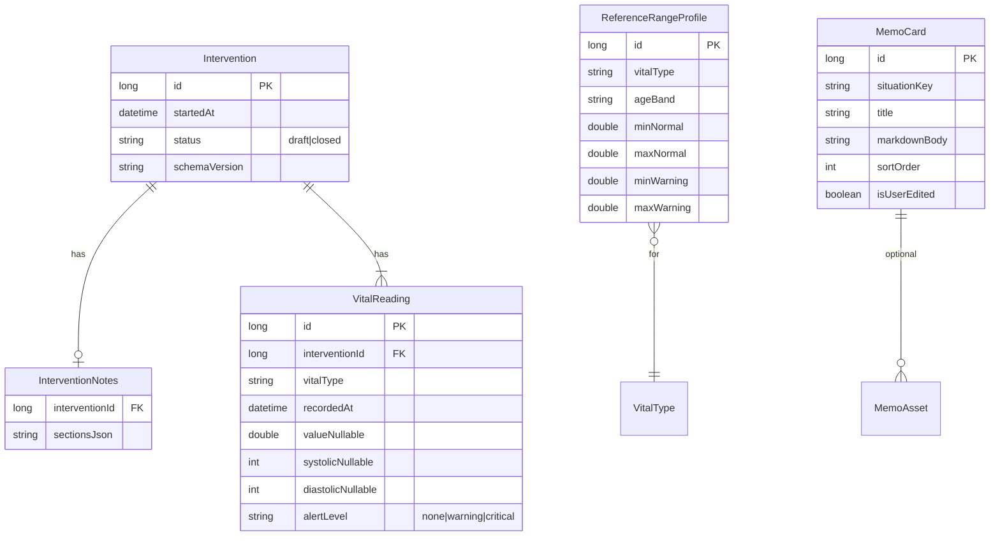

# Architecture Decision Document — NOTES DU SECOURISTE

## 1. Executive Summary

**NOTES DU SECOURISTE** est une application **Android native offline-first** pour secouristes (PSE1/PSE2). Elle remplace le bloc-notes papier par des **notes secouriste** structurées par intervention, des **relevés vitaux horodatés**, une **aide mémoire** Markdown locale et un **script de transmission** rule-based.

**Décisions structurantes :**

| Décision | Choix |
|----------|--------|
| Plateforme | Android uniquement (v1) |
| UI | Jetpack Compose + **Material 3 Expressive** (`MaterialExpressiveTheme` — voir `core-ui/.../Theme.kt`) |
| Persistance | **Room** (SQLite) — source de vérité locale |
| DI | **Hilt** |
| Réseau | **Aucun** en MVP |
| Sync / cloud | **Hors scope** v1 |
| Architecture app | **Modulaire** par feature + core |

---

## 2. Context & Constraints

### 2.1 Exigences pilotes

- **Offline total** : saisie, relevés, historique, aide mémoire, script (NFR-3).
- **Terrain** : sauvegarde auto &lt; 500 ms, cibles ≥ 48 dp, thème sombre (FR-4, FR-5).
- **Relevés** : `recordedAt` **date+heure** en base ; UI **HH:mm** (+ date si jour ≠ intervention) ; antidatage manuel ; **TA** = systolique + diastolique (FR-6).
- **Terminologie** : jamais « bilan » (FR-2).
- **Données sensibles** : traitement type données de santé — minimisation, rétention, chiffrement recommandé (NFR-4, NFR-5).

### 2.2 Hors périmètre v1

Export PDF, sync cloud, LLM, iOS, intégration SAMU/SI.

**État implémentation :** [`../implementation-artifacts/implementation-status.md`](../implementation-artifacts/implementation-status.md)

---

## 3. Technology Stack

| Couche | Technologie | Version cible |
|--------|-------------|---------------|
| Langage | Kotlin | 2.x |
| UI | Jetpack Compose | BOM stable |
| Design | Material 3 Expressive (`material3`) | **Implémenté** (écart vs PRD NFR-8 classique) |
| Navigation | Navigation Compose | 2.x |
| État UI | ViewModel + `StateFlow` | AndroidX Lifecycle |
| Persistance | Room | 2.x |
| DI | Hilt | 2.x |
| Async | Coroutines + Flow | — |
| Tests unitaires | JUnit 5 + MockK | — |
| Tests UI | Compose UI Test | — |
| minSdk | 26 | Android 8.0 |
| targetSdk | 34+ | Aligné store courant |

**Pas de** : Retrofit, WorkManager sync cloud, DataStore pour données métier critiques (Room suffit).

---

## 4. Architecture Style

### 4.1 Pattern global

**Modular monolith** (single APK) avec séparation **feature / core** :

```
┌─────────────────────────────────────────┐
│              :app                      │
│  MainActivity, NavHost, AppTheme       │
└───────────────┬─────────────────────────┘
                │
    ┌───────────┼───────────┬──────────────┐
    ▼           ▼           ▼              ▼
:feature-   :feature-   :core-ui    :core-domain
intervention  aide_memoire            (optionnel v1)
_notes
    │           │
    └─────┬─────┘
          ▼
    :core-data (Room, repositories)
```

### 4.2 Couches par feature

| Couche | Responsabilité |
|--------|----------------|
| **ui** | Composables, ViewModels, navigation locale |
| **domain** | Use cases (optionnel v1 — repositories appelés depuis VM si YAGNI) |
| **data** | Repositories, DAOs, mappers entité ↔ domaine |

**Règle v1 :** les ViewModels des features appellent les **repositories** de `:core-data` ; introduire `:core-domain` avec use cases si la logique métier grossit (script transmission, alertes).

### 4.3 Unidirectional data flow

```
UI (Compose) → ViewModel → Repository → DAO (Room)
                ↑ StateFlow / UiState
```

- Pas de logique métier dans les Composables.
- `UiState` sealed class par écran (Loading, Content, Error).

---

## 5. Bounded Contexts

| Contexte | Responsabilité | Module |
|----------|----------------|--------|
| **Intervention** | Cycle de vie intervention, statut brouillon/clôturée | `feature-intervention_notes` + `core-data` |
| **Notes** | Blocs texte/choix (contexte, victime, gestes…) | `feature-intervention_notes` |
| **Vitals** | Relevés, alertes, références | `feature-intervention_notes` |
| **Transmission** | Récap + script rule-based | `feature-intervention_notes` |
| **Aide mémoire** | Fiches Markdown, assets, édition | `feature-aide_memoire` |
| **Settings** | Références, thème, confidentialité (copy) | `:app` ou `feature-settings` (v1 dans `:app`) |

**Pas de mélange** : tables aide mémoire ≠ tables intervention.

---

## 6. Data Model (Room)

### 6.1 Diagramme entités



### 6.2 Entités détaillées

#### `Intervention`

```kotlin
@Entity(tableName = "interventions")
data class InterventionEntity(
    @PrimaryKey(autoGenerate = true) val id: Long = 0,
    val startedAt: Instant,           // jour de référence pour affichage relevés
    val status: String,               // "draft" | "closed"
    val schemaVersion: String = "v1",
    val closedAt: Instant? = null,
)
```

#### `InterventionNotes`

Sections non-vitales en **JSON typé** (flexibilité schéma papier futur) :

```kotlin
@Entity(tableName = "intervention_notes")
data class InterventionNotesEntity(
    @PrimaryKey val interventionId: Long,
    val sectionsJson: String,  // InterventionSectionsDto
)
```

`InterventionSectionsDto` (Kotlin serializable) :

- `contexte`, `victime`, `gestes`, `evolution`, `transmission` — champs définis en v1 `[ASSUMPTION]` alignés fiches papier ultérieures.

#### `VitalReading`

```kotlin
@Entity(
    tableName = "vital_readings",
    indices = [Index("interventionId"), Index("vitalType")]
)
data class VitalReadingEntity(
    @PrimaryKey(autoGenerate = true) val id: Long = 0,
    val interventionId: Long,
    val vitalType: String,      // "TA", "FC", "FR", "SPO2", ...
    val recordedAt: Instant,    // date + heure complètes — STOCKAGE
    val value: Double? = null,  // scalaires
    val systolic: Int? = null,  // TA
    val diastolic: Int? = null,
    val alertLevel: String = "none",
)
```

**Règles métier :**

- `vitalType == "TA"` → `value` null ; sys + dia requis pour relevé « complet ».
- Alerte calculée à l'écriture via `ReferenceRangeEvaluator` (domain service).

#### `ReferenceRangeProfile`

```kotlin
@Entity(tableName = "reference_ranges")
data class ReferenceRangeEntity(
    @PrimaryKey(autoGenerate = true) val id: Long = 0,
    val vitalType: String,
    val ageBand: String,        // "adult", "child", ...
    val minNormal: Double,
    val maxNormal: Double,
    val minCriticalLow: Double?,
    val maxCriticalHigh: Double?,
    val isFactoryDefault: Boolean = false,
)
```

Seed en migration initiale (défauts usine).

#### `MemoCard`

```kotlin
@Entity(tableName = "memo_cards")
data class MemoCardEntity(
    @PrimaryKey(autoGenerate = true) val id: Long = 0,
    val situationKey: String,
    val title: String,
    val markdownBody: String,
    val imageAssetPath: String? = null,
    val sortOrder: Int,
    val isUserEdited: Boolean = false,
)
```

Pack défaut : import assets → DB au premier lancement (`MemoPackSeeder`).

### 6.3 DAOs principaux

| DAO | Opérations clés |
|-----|-----------------|
| `InterventionDao` | insert, updateStatus, getById, listAll ordered, delete |
| `InterventionNotesDao` | upsert par interventionId |
| `VitalReadingDao` | insert, update, delete, listByInterventionAndType ordered by recordedAt DESC |
| `ReferenceRangeDao` | list, upsert, resetToFactory |
| `MemoCardDao` | list, getById, upsert, delete |

### 6.4 Migrations

- **v1** : toutes tables MVP.
- Pas de pré-création de tables inutiles — aligné epics (tables au besoin des stories).

### 6.5 Chiffrement & rétention

| Mécanisme | Implémentation |
|-----------|----------------|
| Chiffrement DB | **SQLCipher** ou `EncryptedFile` + Room `[ASSUMPTION]` Story 7+ ; documenter choix à l'implémentation |
| Rétention / purge auto | **Hors scope** (D-034) — pas de `RetentionWorker` |
| Suppression | Hard delete cascade (notes, relevés) — **manuelle** depuis liste accueil |

---

## 7. Application Structure (répertoires)

```
notes-du-secouriste/
├── app/
│   ├── src/main/
│   │   ├── java/.../NotesSecouristeApp.kt
│   │   ├── java/.../MainActivity.kt
│   │   ├── java/.../navigation/AppNavHost.kt
│   │   ├── java/.../theme/Theme.kt          # Terrain nocturne ColorScheme
│   │   └── java/.../settings/             # Réglages v1
│   └── build.gradle.kts
├── core/
│   ├── core-data/
│   │   ├── db/AppDatabase.kt
│   │   ├── db/dao/
│   │   ├── db/entity/
│   │   ├── repository/
│   │   └── di/DataModule.kt
│   ├── core-ui/
│   │   ├── components/                    # VitalReadingRow, StatusBadge, ...
│   │   └── theme/Tokens.kt
│   └── core-domain/                       # optionnel — v1.1
│       ├── vitals/ReferenceRangeEvaluator.kt
│       └── transmission/TransmissionScriptBuilder.kt
├── feature/
│   ├── intervention-notes/
│   │   ├── ui/home/                       # S-02 saisie
│   │   ├── ui/recap/
│   │   ├── ui/script/
│   │   ├── ui/history/
│   │   ├── ui/vitals/
│   │   └── InterventionNotesViewModel.kt
│   └── aide-memoire/
│       ├── ui/grid/
│       ├── ui/detail/
│       ├── ui/editor/
│       └── markdown/MemoMarkdownRenderer.kt
├── build.gradle.kts
└── gradle/libs.versions.toml
```

---

## 8. Navigation

### 8.1 Graphe (routes)

| Route | Écran | Module |
|-------|-------|--------|
| `home` | Accueil S-01 | app |
| `intervention/new` | Création → saisie | intervention-notes |
| `intervention/{id}` | Saisie S-02 | intervention-notes |
| `intervention/{id}/recap` | S-03 | intervention-notes |
| `intervention/{id}/script` | S-04 | intervention-notes |
| `history` | S-05 | intervention-notes |
| `intervention/{id}/readonly` | S-06 clôturée | intervention-notes |
| `memo` | Grille S-07 | aide-memoire |
| `memo/{id}` | Détail S-08 | aide-memoire |
| `memo/edit` | S-09 | aide-memoire |
| `settings` | Réglages | app |
| `settings/references` | S-10 | app |
| `settings/privacy` | S-11 | app |

### 8.2 Règles navigation

- Deep link minimal v1 : uniquement `intervention/{id}` depuis historique.
- Back stack : accueil ← saisie ; aide mémoire depuis saisie **sans** perdre brouillon (ViewModel scope `NavBackStackEntry` parent ou `SavedStateHandle` interventionId).

---

## 9. Key Components (implémentation)

| Composant UX | Package | Notes |
|--------------|---------|-------|
| `VitalSignGroup` | `core-ui` | Liste relevés + bouton + Relevé |
| `VitalReadingRow` | `core-ui` | HH:mm chip → `DateTimeEditSheet` |
| `DateTimeEditSheet` | `core-ui` | Material3 `DatePicker` + time wheels |
| `InterventionBlockCard` | `feature-intervention-notes` | Blocs notes |
| `TransmissionScriptView` | `feature-intervention-notes` | Texte généré |
| `SituationCard` | `feature-aide-memoire` | Grille 2 col |
| `RepereMarkdownRenderer` | `feature-aide-memoire` | Compose Markdown léger |
| ~~`OfflineBanner`~~ | — | **Retiré** (D-032) — pas de copy « Hors ligne » |

---

## 10. Core Services

### 10.1 `ReferenceRangeEvaluator`

```kotlin
interface ReferenceRangeEvaluator {
    fun evaluate(
        vitalType: VitalType,
        ageBand: AgeBand,
        value: ScalarValue?,
        systolic: Int?, diastolic: Int?,
    ): AlertLevel
}
```

- Input : profils Room pour type + tranche.
- Output : `NONE | WARNING | CRITICAL`.
- Appelé dans `VitalReadingRepository` à chaque insert/update.

### 10.2 `TransmissionScriptBuilder`

```kotlin
interface TransmissionScriptBuilder {
    fun build(interventionId: Long): String
}
```

- **Rule-based** : templates Kotlin (pas LLM).
- Ordre : contexte → victime → constantes (relevés triés `recordedAt`) → gestes → évolution.
- Format TA : `14h45 — TA 120/80` ; alertes mentionnées en texte.
- Disclaimer appendu côté UI.

### 10.3 `MemoPackSeeder`

- Au premier run : copie JSON/assets → `memo_cards`.
- Idempotent (ne pas dupliquer si déjà seedé).

### ~~10.4 `RetentionWorker`~~ (retiré — D-034)

Pas de purge automatique par durée. Suppression uniquement via UI (liste accueil).

---

## 11. UI Theme (Material 3 classique)

```kotlin
// Theme.kt — MaterialTheme ONLY
private val TerrainNocturneDarkColorScheme = darkColorScheme(
    primary = Color(0xFFE53935),
    secondary = Color(0xFF1565C0),
    background = Color(0xFF121212),
    surface = Color(0xFF1E1E1E),
    // + extension tokens AlertWarning, AlertCritical, StatusDraft, StatusClosed
)
```

- Extensions `Colors` ou `CompositionLocal` pour tokens alerte/statut.
- **Pas** `MaterialExpressiveTheme`.

---

## 12. Cross-Cutting Concerns

### 12.1 Erreurs

- Repository : `Result<T>` ou exceptions catchées en ViewModel → `UiState.Error(message)`.
- Room : transactions pour insert intervention + notes atomiques.

### 12.2 Logging

- `Timber` debug only ; **pas** de logs contenant valeurs vitales en release.

### 12.3 i18n

- `strings.xml` (fr) — revue CI interdiction « bilan ».
- `technical_id` reste anglais dans le code.

### 12.4 Tests

| Niveau | Cible |
|--------|-------|
| Unit | `ReferenceRangeEvaluator`, `TransmissionScriptBuilder`, mappers |
| Room | DAO in-memory |
| Compose UI | VitalReadingRow, navigation home → new intervention |

---

## 13. Security & Privacy

| Mesure | MVP |
|--------|-----|
| Données locales uniquement | Oui |
| Permissions | Aucune réseau ; stockage local ; optionnel CAMERA/galerie pour images aide mémoire v1.1 |
| Backup Android | `android:allowBackup="false"` ou exclude DB `[ASSUMPTION]` |
| App lock PIN/bio | v1.1 (PRD open) |

---

## 14. Epic → Module Mapping

| Epic | Modules principaux |
|------|-------------------|
| E1 Fondation | `:app`, `:core-ui/theme` |
| E2 Saisie blocs | `:feature-intervention-notes`, `:core-data` notes |
| E3 Relevés | `:core-data` vitals, `:core-domain` evaluator, `:core-ui` vitals |
| E4 Transmission | `:core-domain` script, `:feature-intervention-notes` recap/script |
| E5 Historique | `:feature-intervention-notes` history |
| E6 Aide mémoire | `:feature-aide-memoire` |
| E7 Suppression | Liste accueil (déjà impl.), copy confidentialité Réglages optionnel |

---

## 15. Architecture Decision Records (ADR)

### ADR-001 : Room comme source de vérité unique

**Statut :** Accepté  
**Contexte :** Offline 100 %, relations intervention ↔ relevés.  
**Décision :** Room/SQLite ; pas de sync.  
**Conséquences :** Simple, testable ; limite multi-appareils reportée.

### ADR-002 : Sections notes en JSON

**Statut :** Accepté  
**Contexte :** Schéma blocs pas encore figé (fiches papier).  
**Décision :** `sectionsJson` versionné par `schemaVersion`.  
**Conséquences :** Migration schéma sans ALTER massif ; validation côté app.

### ADR-003 : recordedAt Instant complet, UI HH:mm

**Statut :** Accepté  
**Contexte :** Surveillance dans le temps ; antidatage ; minuit.  
**Décision :** Stocker `Instant` ; formater en UI.  
**Conséquences :** Script et récap cohérents.

### ADR-004 : Material 3 classique

**Statut :** Accepté (D-025)  
**Décision :** `MaterialTheme` standard.  
**Conséquences :** Pas de dépendance alpha Expressive.

### ADR-005 : Script transmission rule-based

**Statut :** Accepté  
**Décision :** `TransmissionScriptBuilder` templates, pas LLM.  
**Conséquences :** Prévisible, offline, maintenable.

---

## 16. Open Technical Items

| ID | Sujet | Impact |
|----|-------|--------|
| T-001 | SQLCipher vs Room plain + file encryption | Story sécurité |
| T-002 | Schéma exact `InterventionSectionsDto` | Après fiches papier |
| T-003 | Lib Markdown Compose (compose-markdown vs custom) | Epic 6 |
| T-004 | App lock MVP ou v1.1 | Settings |

---

## 17. Handoff développement

**Ordre d’implémentation recommandé :** Epics 1 → 2 → 3 → 4 → 5 → 6 → 7 (aligné `epics.md`).

**Fichiers de référence pour agents :**

- PRD : `prds/prd-NOTES SECOURISTE-2026-05-20/prd.md`
- UX : `ux-design-specification.md`
- Stories : `epics.md`
- Architecture : ce document

**Commande projet suggérée :** package `com.notesdusecouriste.app` `[ASSUMPTION]`.

---

*Document finalisé — prêt pour `bmad-dev-story` / implémentation Epic 1.*
