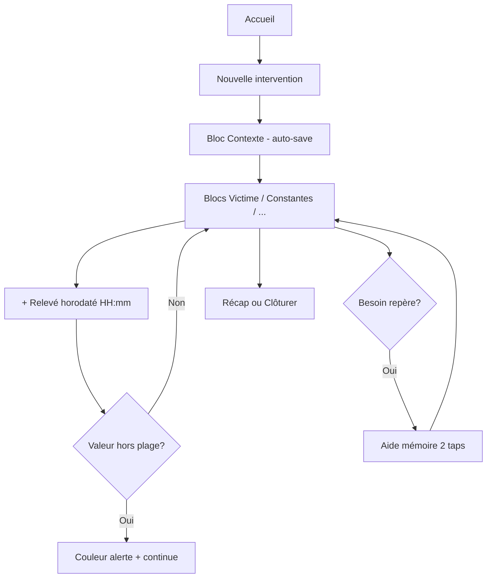
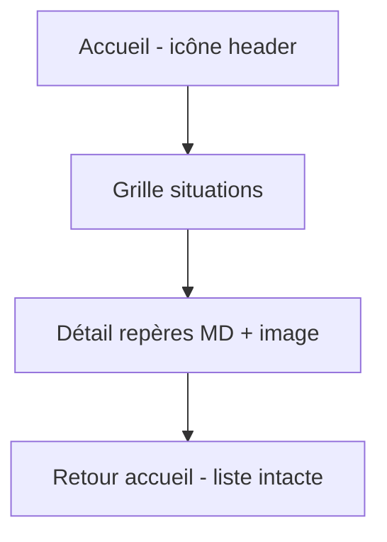
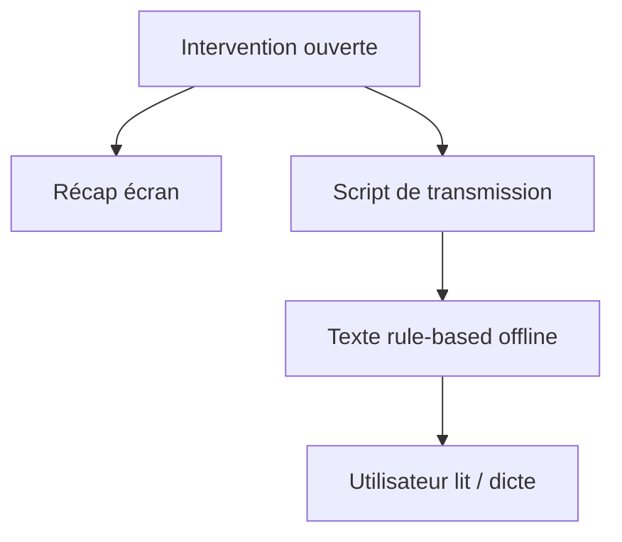
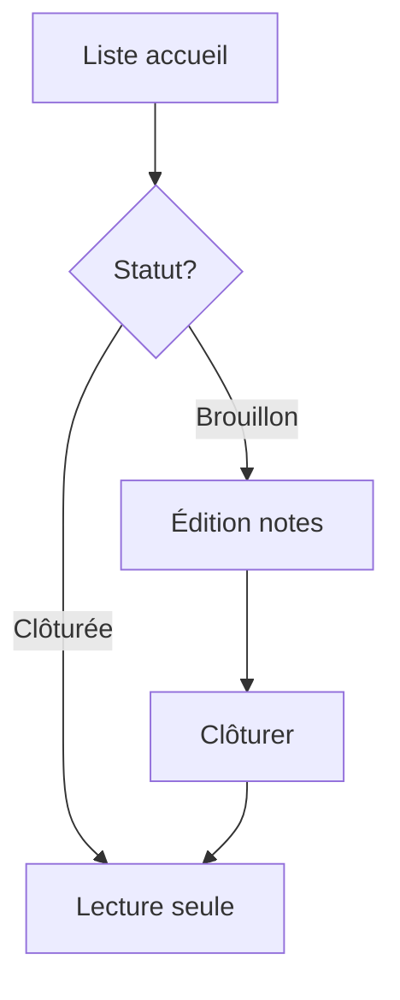

# UX Design Specification — NOTES DU SECOURISTE

**Auteur :** Marti  
**Date :** 2026-05-20  
**Statut :** final  
**PRD :** `prd-NOTES SECOURISTE-2026-05-20/prd.md`

---

## Executive Summary

### Project Vision

**NOTES DU SECOURISTE** remplace le bloc-notes papier du secouriste (PSE1/PSE2) par une expérience Android **100 % hors ligne**, centrée sur la **saisie sur le vif** et la **transmission orale**. Le produit n’est pas un bilan médical officiel : vocabulaire **« Notes secouriste »** / **« Intervention »** uniquement — jamais « bilan ».

### Target Users

**Persona primaire — Léa, PSE2 bénévole**  
Interventions événementielles, smartphone Android personnel, saisie au plus près de la victime (souvent avec gants), transmission orale au chef d’équipe ou préparation appel 15. Besoin de rapidité, reprise sans perte, repères protocole en 2–3 secondes.

### Key Design Challenges

1. **Stress & contraintes physiques** — gants, une main, bruit, luminosité variable.
2. **Double mode produit** — saisie dynamique (notes) vs consultation statique (aide mémoire) sans confusion.
3. **Relevés multiples horodatés** — suivre l’évolution des constantes (TA, FC…) sur la durée de l’intervention.
4. **Alertes cliniques non bloquantes** — signaler l’anormal sans interrompre l’intervention.
5. **Confiance offline** — persistance locale fiable ; pas de signal UI « Hors ligne » (comportement silencieux).
6. **Terminologie métier** — éviter toute confusion avec un document réglementé.

### Design Opportunities

1. **Repères visuels** (aide mémoire) alignés sur le même vocabulaire que les notes.
2. **Script de transmission** — valeur immédiate vs papier (ordre de dictée).
3. **Récap lisible à distance** — binôme / chef lit l’écran.
4. **Personnalisation** des plages de constantes et des fiches aide mémoire.

---

## Core User Experience

### Defining Experience

**Action centrale :** saisir et compléter des **notes secouriste** pendant une **intervention** (brouillon), avec sauvegarde automatique. Tout le reste (aide mémoire, historique, script) gravitent autour de ce flux.

**Boucle principale :** Accueil → Nouvelle intervention → Blocs de saisie → (optionnel) Repère aide mémoire → Récap / Script → Clôture.

### Platform Strategy

| Dimension | Décision |
|-----------|----------|
| Plateforme | Android natif uniquement (v1) |
| Interaction | Touch, pouce dominant, zones ≥ 48 dp |
| Connectivité | 100 % offline MVP |
| Densité | Mobile portrait first ; pas de tablette v1 |

### Effortless Interactions

- Création intervention en **1 tap** (horodatage immédiat).
- **Sauvegarde auto** — aucun bouton Enregistrer.
- **Reprise** exacte du scroll/bloc après interruption.
- Aide mémoire : situation → repères en **≤ 2 taps** depuis l’accueil.
- Alertes constantes : feedback **immédiat**, jamais de modal bloquant.

### Critical Success Moments

| Moment | Succès | Échec |
|--------|--------|-------|
| Première saisie sous stress | Champ rempli sans chercher un menu | Perte de contexte / perte de données |
| Alerte TA hors plage | Couleur visible, saisie continue | Popup bloquant |
| Consultation PLS | Repère lu en &lt; 10 s | Mur de texte |
| Transmission | Script oral fluide depuis l’écran | Export manquant alors que oral = besoin |
| Clôture | Lecture seule claire + duplication si erreur | Modification accidentelle post-clôture |

### Experience Principles

1. **Terrain d’abord** — chaque écran justifie sa place debout, une main, en urgence.
2. **Deux portes égales** — Notes d’intervention ≠ Aide mémoire (pas un sous-menu).
3. **Couches, pas formulaire monolithique** — blocs complétés progressivement.
4. **Offline = normal** — comportement 100 % local ; **pas** de bandeau ni libellé « Hors ligne » sur l’accueil (confiance par la stabilité, pas par le rappel).
5. **Jamais « bilan »** — copy, export futur, script de transmission.

---

## Desired Emotional Response

### Primary Emotional Goals

- **Assuré** — « mes notes sont là, même sans réseau ».
- **Concentré** — interface calme, pas de bruit UI en intervention.
- **Prêt à transmettre** — script et récap donnent confiance pour l’oral.

### Emotional Journey Mapping

| Phase | Émotion cible | À éviter |
|-------|---------------|----------|
| Ouverture app | Clarté, urgence maîtrisée | Charge cognitive (trop d’options) |
| Saisie | Flow, efficacité | Culpabilité (champs manquants bloquants) |
| Alerte constante | Vigilance, pas panique | Peur (modal alarmiste) |
| Aide mémoire | Soulagement rapide | Submergé par le texte |
| Clôture | Accomplissement, clôture nette | Doute (« est-ce enregistré ? ») |

### Micro-Emotions

Priorité : **Confiance** &gt; Confusion · **Efficacité** &gt; Anxiété · **Accomplissement** &gt; Frustration.

### Design Implications

| Émotion | UX |
|---------|-----|
| Assuré | Indicateur sauvegarde / statut brouillon visible |
| Concentré | Mode sombre par défaut `[ASSUMPTION]` ; peu de notifications |
| Vigilant | Couleur ambre/rouge sur champ, pas d’alarme sonore invasive |
| Accomplissement | Animation légère à la clôture ; badge « Clôturée » |

### Emotional Design Principles

- Ne jamais punir une saisie incomplète en intervention.
- Les disclaimers (script, alertes) renforcent la **responsabilité** sans casser le flow.

---

## UX Pattern Analysis & Inspiration

### Reference Patterns (conceptuels)

| Pattern | Source type | Application |
|---------|-------------|-------------|
| FAB / carte action principale | Apps terrain | « Nouvelle intervention » dominante |
| Formulaire par étapes (non wizard bloquant) | Santé / logistique | Blocs scrollables libres |
| Bottom sheet info | Material | ⓘ valeurs de référence |
| Offline-first badge | Cartes / notes offline | Confiance réseau |
| Cartes situation | Apps checklist | Grille aide mémoire |

### Anti-patterns à éviter

- Wizard avec « Suivant » obligatoire entre chaque champ.
- Dashboard analytics / graphiques (hors scope).
- Terminologie hospitalière (« dossier patient », « bilan »).

---

## Design System

### Choice

**Material Design 3 classique** (pas Material 3 Expressive) via **Jetpack Compose** `androidx.compose.material3:material3` — thème **`MaterialTheme`**, composants M3 standards.

**Décision produit (2026-05-21) :** **M3 classique** pour le MVP — API stable, UI sobre et prévisible sur le terrain (saisie sous stress, gants). Material 3 Expressive (`MaterialExpressiveTheme`, motion/shapes expressifs) **hors périmètre v1** ; réévaluation possible en v1.1+ pour l’accueil ou l’aide mémoire uniquement.

### Customization

- Tokens couleur sémantiques (alerte limite / critique, statut brouillon/clôturée) — `ColorScheme` M3.
- Typographie : échelle **Material 3 type** (pas la variante expressive) + **taille utilisateur** réglable.
- Formes : `Shapes` M3 par défaut (coins modérés) — pas de morphing ni motion scheme expressive.
- Composants custom documentés § Composants custom.

---

## Core Interaction Definition

### Accueil (S-01) — hub unique

**Décisions UX 2026-05-20 :** pas de page Historique dédiée ; pas de mention « Hors ligne » ; aide mémoire en **icône seule** dans le header ; toggle thème en haut à droite.

```
┌──────────────────────────────────────┐
│ NOTES DU SECOURISTE      [📖] [☀/🌙] │  ← Aide mémoire = icône ; toggle thème
├──────────────────────────────────────┤
│ ┌──────────────────────────────────┐ │
│ │     + Nouvelle intervention       │ │  ← CTA hero (AU-DESSUS de la liste)
│ │       Notes secouriste            │ │
│ └──────────────────────────────────┘ │
│ ───────────────────────────────────── │
│ ● DUPONT Jean - 42 ans               │  ← Liste interventions (EN DESSOUS)
│   21/05/2026 - 14:32                 │     L1 : NOM Prénom - Âge
│ ● Intervention en cours              │     L2 : Date - heure
│   20/05/2026 - 09:15                 │     Pastille couleur = statut
│ ...                                  │
└──────────────────────────────────────┘
```

**Carte intervention (liste accueil)**

| Élément | Règle |
|---------|--------|
| Ligne 1 | `NOM Prénom - Âge` si renseignés ; sinon placeholder (ex. « Intervention en cours ») — jamais `null` / tirets vides |
| Ligne 2 | `dd/MM/yyyy - HH:mm` (locale FR) |
| Pastille | Couleur token `status-draft` / `status-closed` + `contentDescription` TalkBack |
| Tap | Ouvre l’intervention (brouillon ou clôturée) |

**État vide :** message discret (« Aucune intervention enregistrée ») puis CTA **Nouvelle intervention** visible — pas d’écran mort.

**Aide mémoire (header) :** `IconButton` ≥ 48 dp ; icône type `MenuBook` ; `contentDescription` = « Aide mémoire » (pas de libellé texte visible).

### Notes secouriste — structure des blocs

Ordre de dictée recommandé (aligné transmission orale) :

| # | Bloc | Contenu clé |
|---|------|-------------|
| 1 | Contexte | Lieu, heure (auto), type événement, circonstances |
| 2 | Victime | Âge/tranche, sexe, conscience, position |
| 3 | Constantes | TA, FC, FR, SpO2, température, glycémie — **plusieurs relevés horodatés (HH:mm) par type** |
| 4 | Examen / lésions | Zones, mécanisme |
| 5 | Gestes & soins | Gestes réalisés, matériel |
| 6 | Évolution | État actuel, surveillance |
| 7 | Transmission | Éléments à dire au SAMU/chef, contact 15 |

Chaque bloc = **carte** Material avec titre, champs, indicateur complétion optionnel (discret).

### Barre d’actions intervention (brouillon)

- **Récap** · **Script de transmission** · **Aide mémoire** (overlay retour) · **Clôturer**
- FAB ou bouton fixe bas d’écran : zone pouce

### Intervention clôturée

- Tous champs disabled / lecture seule
- Actions : **Supprimer** · **Récap** · **Script** (pas de Dupliquer — D-033)
- Bannière : « Intervention clôturée — lecture seule »

---

## Visual Design Foundation

### Direction retenue : **Terrain nocturne**

Application souvent utilisée de nuit, sous tribune, en extérieur. **Deux thèmes** Material 3 (clair + sombre), contrastes élevés, accents fonctionnels (pas décoratifs). Palette **Terrain nocturne** pour le mode sombre ; palette claire dérivée (surfaces M3, pas de blanc pur #FFFFFF plein écran).

### Thème & apparence (Réglages + accueil)

| Contrôle | Comportement |
|----------|----------------|
| **Toggle** (coin supérieur droit, accueil) | Bascule immédiate clair ↔ sombre ; enregistre le dernier choix explicite (`LIGHT` / `DARK`) |
| **Politique d’ouverture** (Réglages → Apparence) | **Thème système** (défaut) · **Dernier thème choisi** |
| **Thème système** | Au cold start : suit `isSystemInDarkTheme()` ; le toggle peut forcer clair/sombre pour la session courante |
| **Dernier thème choisi** | Au cold start : **ignore** le thème système Android ; applique uniquement le dernier `LIGHT` ou `DARK` choisi dans l’app |

**Copy Réglages (une phrase) :** *Thème système* — « Comme mon téléphone. » · *Dernier thème choisi* — « Toujours comme je l’ai laissé dans l’app. »

### Color Tokens

| Token | Rôle | Valeur indicative |
|-------|------|-------------------|
| `background` | Fond app | #121212 |
| `surface` | Cartes blocs | #1E1E1E |
| `primary` | Actions principales | #E53935 (rouge secours, sobre) |
| `on-primary` | Texte sur primary | #FFFFFF |
| `secondary` | Aide mémoire, secondaire | #1565C0 |
| `alert-warning` | Constante limite | #FFA726 (ambre) |
| `alert-critical` | Constante critique | #EF5350 (rouge champ) |
| `success` | Sauvegardé / OK | #66BB6A |
| `text-primary` | Corps | #F5F5F5 |
| `text-secondary` | Labels | #B0BEC5 |
| `status-draft` | Brouillon | #42A5F5 |
| `status-closed` | Clôturée | #78909C |

**Mode clair** : obligatoire en MVP (toggle + tokens validés WCAG AA) — pas seulement une hypothèse.

### Typography

| Rôle | Style | Taille min |
|------|-------|------------|
| Titre écran | Headline Medium | 24 sp |
| Titre bloc | Title Large | 20 sp |
| Champ / saisie | Body Large | 18 sp |
| Récap / script | Headline Small | 22 sp, line-height 1.4 |
| Repère aide mémoire | Title Medium | 18 sp |
| Légende | Label Medium | 14 sp |

Réglage utilisateur : **Échelle 100 % / 115 % / 130 %** dans Accessibilité.

### Spacing & Touch

- Grille base : **8 dp**
- Padding carte bloc : 16 dp
- Entre champs : 12 dp
- Cibles tactiles : min **48 × 48 dp** ; champs numériques hauteur min **56 dp**

---

## Design Direction Decision

**Direction retenue : D1 — Terrain nocturne (compact)**  
Voir explorations : `_bmad-output/planning-artifacts/ux-design-directions.html`

Caractéristiques :
- Accueil : header (icône aide mémoire + toggle thème) + CTA hero + liste interventions
- Saisie cartes empilées, barre basse fixe
- Aide mémoire : grille 2 colonnes de cartes situation
- Récap plein écran, typo large, fond surface élevée

---

## Information Architecture

```
Accueil (hub — liste + actions)
├── Header : icône Aide mémoire · toggle thème
├── Nouvelle intervention → Saisie notes (brouillon)
│   ├── Blocs 1..n
│   ├── Récap
│   ├── Script de transmission
│   └── Clôturer → reprise via liste accueil (lecture seule)
├── Liste interventions (tap → détail selon statut)
├── Aide mémoire (depuis header)
│   ├── Grille situations
│   ├── Détail repères (Markdown)
│   └── Éditer fiches (mode édition)
└── Réglages
    ├── Valeurs de référence
    ├── Confidentialité (suppression manuelle — pas de purge auto)
    ├── Aide mémoire (gestion pack)
    ├── Apparence (politique thème : Système | Dernier choisi ; taille texte)
    └── À propos / disclaimers
```

*Pas d’écran « Historique » séparé — la liste sur l’accueil couvre FR-11.*

---

## User Journey Flows

### UJ-1 — Saisie notes sur le vif



### UJ-2 — Aide mémoire repères



### UJ-3 — Transmission orale



### UJ-4 — Reprise & clôture (depuis liste accueil)



### Journey Patterns

| Pattern | Règle |
|---------|-------|
| Navigation retour | Toujours préserver brouillon |
| Feedback sauvegarde | Snackbar discret ou icône cloud barré « Enregistré localement » |
| Confirmation destructive | Supprimer intervention, clôturer (si champs vides warning seulement) |
| État vide historique | CTA « Nouvelle intervention » |

### Flow Optimization Principles

- Minimiser taps jusqu’au premier champ utile : **1**.
- Pas de validation bloquante en saisie ; validation douce à la clôture optionnelle `[ASSUMPTION]`.

---

## Component Strategy

### Material 3 (stock)

Buttons, FAB, Cards, TextFields, TopAppBar, BottomSheet, Snackbar, List, Chips, Switch, Dialog.

### Composants custom

#### VitalSignGroup (par type de constante)

**Purpose :** Regrouper tous les **relevés** d’une même constante (ex. TA) dans le bloc Constantes.  
**Anatomy :** Titre constante + ⓘ + liste de relevés + bouton **« + Relevé »**.  
**Actions :** ajouter relevé ; modifier valeur ; ajuster horodatage HH:mm ; supprimer relevé.

#### VitalReadingRow (un relevé)

**Purpose :** Une mesure horodatée.  
**Anatomy :**
- **TimestampChip** : affiche `HH:mm` (ou `dd/MM HH:mm`) — tap → `DateTimeEditSheet`
- **Valeur** : champ unique OU paire **SysField** `/` **DiaField** (TA)
- Indicateur alerte + supprimer

**States :** default, focused, warning, critical, disabled (clôturée), incomplete (TA : une moitié vide).  
**Default :** `recordedAt` = `now()` à la création.  
**Rules :**
- Dernier relevé en haut de liste.
- TA : saisie consécutive sys → dia ; un seul `recordedAt` pour la paire.
- Pas de modal bloquant à l’ajout.

#### DateTimeEditSheet

**Purpose :** Antidater ou corriger un relevé.  
**Fields :** DatePicker + TimePicker (heure, minute).  
**Persist :** met à jour `recordedAt` complet en base.

**Accessibility :** « Tension artérielle, 14 h 32, 120 sur 80, alerte limite » ; si date hors jour : annoncer la date complète.

#### VitalSignField (legacy label)

Alias du couple **VitalSignGroup** + **VitalReadingRow** dans les specs dev.

#### InterventionBlockCard

**Purpose :** Conteneur d’un bloc de notes.  
**States :** expanded/collapsed `[ASSUMPTION]` ; indicateur « partiel » optionnel.  
**Actions :** scroll; header tap collapse.

#### SituationCard (Aide mémoire)

**Purpose :** Entrée grille situation.  
**Content :** Titre court, icône, 1 ligne sous-titre.  
**Size :** min height 96 dp, 2 colonnes.

#### RepereMarkdownView

**Purpose :** Rendu compact Markdown + image.  
**Rules :** H1 interdit en rendu (titre carte) ; listes max 5 items visibles sans scroll si possible.

#### TransmissionScriptView

**Purpose :** Affichage script oral.  
**Typography :** 22 sp+, paragraphes courts, sections avec séparateurs.  
**Constantes :** chaque type listé avec relevés en ligne du type « TA : 14h32 → 120/80 ; 14h45 → 118/75 (alerte limite) ».  
**Footer :** « Relire avant transmission — ne remplace pas votre jugement ».

#### StatusBadge

**Values :** `Brouillon` · `Clôturée` — couleur token status-*.

#### ~~OfflineIndicator~~ (retiré MVP 2026-05-20)

**Décision :** composant et copy « Hors ligne » **supprimés** — l’app reste 100 % offline sans l’afficher.

---

## UX Consistency Patterns

### Buttons

| Niveau | Usage |
|--------|-------|
| Primary filled | Nouvelle intervention, Clôturer (confirm) |
| Secondary outlined | Annuler, Supprimer (liste) |
| Text | Actions tertiaires historique |

### Feedback

| Type | Pattern |
|------|---------|
| Sauvegarde | Snackbar 2s « Enregistré » |
| Alerte constante | Couleur champ uniquement |
| Erreur système | Snackbar + action retry |
| Clôture | Dialog confirmation simple |

### Forms

- Clavier numérique pour constantes et âge.
- Pickers pour listes fermées (lieu type, mécanisme).
- Pas de champ obligatoire bloquant mid-flow.

### Navigation

- **Accueil :** TopAppBar = titre + icône Aide mémoire + toggle thème (pas de menu Historique).
- **Autres écrans :** TopAppBar = titre + retour + accès Réglages si pertinent.
- Pas de bottom nav 4 onglets — accueil hub `[ASSUMPTION]`.

### Empty States

- Liste accueil vide : message sobre + CTA **Nouvelle intervention** (pas d’illustration lourde).
- Aide mémoire : pack défaut toujours présent (pas vide).

---

## Responsive Design & Accessibility

### Responsive (Android phones)

| Taille | Adaptation |
|--------|------------|
| Compact (&lt; 360 dp) | Grille aide mémoire 1 colonne ; padding réduit 12 dp |
| Standard | 2 colonnes situation |
| Large / font scale 130 % | Scroll récap ; champs stack vertical |

Pas de support tablette v1.

### Accessibility

| Exigence | Implémentation |
|----------|----------------|
| Contraste | WCAG AA minimum (4.5:1 texte) |
| TalkBack | Ordre focus = ordre blocs ; annonce alertes |
| Taille texte | Réglage 100–130 % |
| Couleur seule | Alerte = couleur + icône + label texte |
| Touch | 48 dp min ; espacement gants |
| Haptique | Optionnelle sur clôture `[ASSUMPTION]` |

---

## Screen Inventory (MVP)

| ID | Écran | FR liés |
|----|-------|---------|
| S-01 | Accueil (liste interventions + CTA + header) | FR-1, FR-2, FR-11, FR-18 |
| S-02 | Saisie notes (blocs) | FR-3–8 |
| S-02b | Date + heure du relevé (antidatage) | FR-6 |
| S-02c | Saisie TA sys → dia (inline ou mini-stepper) | FR-6 |
| S-03 | Récap | FR-9 |
| S-04 | Script transmission | FR-10 |
| ~~S-05~~ | ~~Historique liste~~ | *Fusionné dans S-01 (2026-05-20)* |
| S-06 | Détail intervention | FR-12 |
| S-07 | Aide mémoire grille | FR-14, FR-15 |
| S-08 | Aide mémoire détail | FR-14 |
| S-09 | Éditeur aide mémoire | FR-16 |
| S-10 | Réglages références | FR-8 |
| S-11 | Réglages confidentialité (copy suppression ; pas de rétention auto) | FR-17 |

---

## Copy & Terminology Guardrails

| ✅ Utiliser | ❌ Interdit |
|------------|------------|
| Nouvelle intervention | Nouveau bilan |
| Notes secouriste | Fiche bilan |
| Script de transmission | Résumé médical |
| Intervention clôturée | Bilan validé |
| Repère | Protocole complet (trop long) |

---

## Constantes — Relevés multiples (ajout 2026-05-21, rev. 2026-05-21)

### Horodatage — règles UX

| Couche | Règle |
|--------|--------|
| **Base de données** | `recordedAt` = **date + heure** complètes (instant local) |
| **Liste (défaut)** | Afficher **HH:mm** seulement |
| **Liste (exception)** | Si `recordedAt.date` ≠ date de début d'intervention → afficher **`dd/MM HH:mm`** (ex. `23/05 14:32`) |
| **Antidatage** | Tap sur l'horodatage → sheet **Date + Heure** (date picker + heure/min) ; enregistre le nouvel instant |

### Comportement UX — TA (2 saisies consécutives)

```
┌─ TA ─────────────────────── ⓘ ─┐
│ 14:45  [120] / [80]      ⚠  🗑 │  ← Sys puis Dia, même ligne
│ 14:32  [118] / [75]          🗑 │
│ [ + Relevé TA ]                │
└────────────────────────────────┘
```

- Saisie d'un **+ Relevé TA** : focus **systolique** → validation/suivant → focus **diastolique** (même `recordedAt`).
- Clavier numérique ; séparateur visuel `/` entre les deux champs.
- Alerte couleur évaluée sur la paire (règles référence TA).

### Comportement UX — constante scalaire (FC, FR, …)

```
┌─ FC ─────────────────────── ⓘ ─┐
│ 14:50  [ 72 ]              🗑   │
│ 14:32  [ 68 ]                  │
│ [ + Relevé ]                   │
└────────────────────────────────┘
```

### Sheet « Date et heure du relevé »

- Titre : **Quand ce relevé a-t-il été pris ?**
- Champs : **Date** (picker calendrier) + **Heure** + **Minutes**
- Défaut à l'ouverture : valeurs actuelles du `recordedAt`
- Actions : **Enregistrer** · **Annuler**
- Usage : saisie en retard, intervention après minuit, correction d'erreur

### Récap / Script

- Format TA : `14h45 — TA 120/80 (alerte limite)`
- Si date affichée en liste : reprendre dans le script (`23/05 14h45 — …`)

---

## Open UX Items (from PRD)

1. Schéma champs exact par bloc — attente 3 fiches papier.
2. Tranches d’âge labels/bornes.
3. Lien alerte → fiche aide mémoire (P1).
4. Collapse blocs ou toujours ouverts v1.

---

## Traceability

| PRD Journey | UX Section |
|-------------|------------|
| UJ-1 | S-02, S-02b, VitalSignGroup, VitalReadingRow, flows UJ-1 |
| UJ-2 | S-07, S-08, SituationCard |
| UJ-3 | S-03, S-04 |
| UJ-4 | S-05, S-06, clôture |

---

*Fin de la spécification UX — prête pour architecture et epics.*
