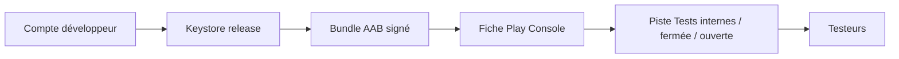

# Publication bêta Play Store — Notes du Secouriste

Guide pas à pas pour publier la **version bêta** sur Google Play. État technique du projet au **juin 2026**.

| Élément | Valeur actuelle |
|---------|-----------------|
| Package | `com.notesdusecouriste.app` |
| versionCode | `6` (incrémenter à chaque upload) |
| versionName | `0.3.0-beta` |
| minSdk | 26 |
| targetSdk | 35 |
| Réseau | Aucune permission `INTERNET` — app hors ligne |
| Signature release | Configurée via `keystore.properties` (voir ci-dessous) |

## Vue d’ensemble



---

## Phase 1 — Compte et application

### 1.1 Compte Google Play Developer

- Créer ou utiliser un compte sur [Google Play Console](https://play.google.com/console).
- Frais unique **25 USD** (compte développeur).
- Renseigner identité éditeur (personne physique, association ou société).

### 1.2 Créer l’application

- **Créer une application** → nom *Notes du Secouriste*.
- Cocher les déclarations (politiques Play, US export, etc.).
- Type : **Application** (pas jeu).

### 1.3 Piste bêta recommandée

| Piste | Usage |
|-------|--------|
| **Tests internes** | 100 testeurs max, diffusion en quelques minutes — idéal pour vous + binôme |
| **Tests fermés** | Liste d’e-mails ou groupe Google — association / bêta-testeurs |
| **Tests ouverts** | Bêta publique avec lien d’inscription — après stabilisation |

Pour une première bêta : commencer par **Tests internes**, puis **Tests fermés**.

---

## Phase 2 — Signature et build release

### 2.1 Générer un keystore (une seule fois)

Depuis `android/` (adapter chemins et mots de passe) :

```powershell
$env:JAVA_HOME = "C:\Program Files\Android\Android Studio\jbr"
keytool -genkeypair -v `
  -keystore release-keystore.jks `
  -alias notes-du-secouriste `
  -keyalg RSA -keysize 2048 -validity 10000 `
  -storetype JKS
```

- Conserver `release-keystore.jks` en lieu sûr (copie chiffrée, coffre).
- **Ne jamais** le committer dans Git.

### 2.2 Fichier `keystore.properties`

```powershell
Copy-Item keystore.properties.example keystore.properties
# Éditer keystore.properties avec vos mots de passe
```

### 2.3 Produire le bundle (AAB)

```powershell
cd android
$env:JAVA_HOME = "C:\Program Files\Android\Android Studio\jbr"
.\gradlew.bat bundleRelease
```

Sortie : `android/app/build/outputs/bundle/release/app-release.aab`

Fichiers utiles pour la Play Console (avertissements désobscurcissement / symboles natifs) :

| Fichier | Rôle |
|---------|------|
| `app/build/outputs/mapping/release/mapping.txt` | Désobscurcissement R8 (import automatique avec l’AAB si R8 activé) |
| Symboles natifs | `ndk.debugSymbolLevel = FULL` + ZIP manuel : `app/build/outputs/native-debug-symbols/release/native-debug-symbols.zip` |

Sans `keystore.properties`, la tâche échoue ou signe en debug — la release Play exige une **signature release**.

### 2.4 Play App Signing

À la première upload, activer **Play App Signing** (recommandé) : Google conserve la clé de signature finale ; vous uploadez avec la clé upload (votre keystore).

### 2.4b Symboles de débogage natifs (upload manuel)

Si la Play Console demande encore **« Symboles de débogage natifs »** après l’AAB :

1. Rebuild : `.\gradlew.bat :app:bundleRelease` (génère aussi le ZIP).
2. Fichier à importer :

```
android/app/build/outputs/native-debug-symbols/release/native-debug-symbols.zip
```

3. Dans la console : **Test et publication** → **Explorateur d’app bundles** → sélectionner la version → onglet **Téléchargements** → section **Assets** → flèche d’upload **Symboles de débogage natifs** (ou *Native debug symbols*).

Ce ZIP doit avoir les ABI **à la racine** (`arm64-v8a/`, `armeabi-v7a/`, …), **sans** dossier `lib/`. Structure attendue :

```
native-debug-symbols.zip
├── arm64-v8a/*.so
├── armeabi-v7a/*.so
├── x86/*.so
└── x86_64/*.so
```

L’avertissement est **recommandé**, pas bloquant pour une bêta.

### 2.5 Versions suivantes

À chaque nouvelle version acceptée par Google :

1. Incrémenter `versionCode` dans `android/app/build.gradle.kts` (obligatoire).
2. Mettre à jour `versionName` (ex. `0.2.2-beta`).
3. Rebuild `bundleRelease` et uploader.

---

## Phase 3 — Contenu obligatoire Play Console

### 3.1 Fiche store

Textes prêts à l’emploi : [`store-listing-fr.md`](store-listing-fr.md)  
Assets : [`play-store-assets.md`](play-store-assets.md)

### 3.2 Politique de confidentialité

- Page web prête pour GitHub Pages : [`docs/index.html`](index.html) (éditeur + e-mail à compléter).
- Guide : [`github-pages-confidentialite.md`](github-pages-confidentialite.md) — dépôt **`notes-du-secouriste`**.
- URL Play Console (exemple) : `https://VOTRE_COMPTE.github.io/notes-du-secouriste/`
- Source Markdown : [`privacy-policy-fr.md`](privacy-policy-fr.md).

### 3.3 Classification du contenu

Questionnaire IARC dans la console — application utilitaire, pas de contenu choquant. Répondre honnêtement (pas de violence simulée, etc.).

### 3.4 Public cible et sécurité des enfants

- Cible : **18+** recommandé (données de santé / intervention, pas une app enfant).
- Déclaration Families : généralement **non** ciblée enfants.

### 3.5 Sécurité des données (Data safety)

Réponses cohérentes avec l’app réelle :

| Question | Réponse |
|----------|---------|
| Collecte de données | **Non** — pas de transmission vers l’éditeur |
| Données chiffrées en transit | N/A (pas de serveur éditeur) |
| Suppression des données | Oui — suppression dans l’app / désinstallation |
| Types de données | Données saisies par l’utilisateur, stockées **localement** (santé / infos personnelles si vous déclarez les champs victime) |

Détail : l’utilisateur peut ouvrir des **liens externes** depuis l’aide-mémoire (navigateur tiers) — le mentionner si demandé.

### 3.6 Déclarations santé / dispositif médical

- L’app est un **outil de notes**, pas un DM (dispositif médical).
- Dans la description et les notes : **ne remplace pas un bilan officiel**.
- Si Google pose des questions « medical device » : préciser usage secouriste / mémorisation terrain, sans diagnostic ni prescription.

### 3.7 Pays et appareils

- Commencer par **France**.
- Téléphones + tablettes si l’UI le permet (Compose responsive — OK en pratique).

---

## Phase 4 — Upload et testeurs

1. Play Console → votre app → **Tests** → **Tests internes** (ou fermés).
2. **Créer une version** → uploader `app-release.aab`.
3. Renseigner **notes de version** (voir `store-listing-fr.md`).
4. **Vérifier la version** → résoudre les avertissements (icône, captures, politique, etc.).
5. **Déployer** sur la piste.
6. **Testeurs** : ajouter e-mails (interne) ou lien d’inscription (fermé/ouvert).

Les testeurs installent via le lien Play (« Rejoindre le programme bêta »).

---

## Phase 5 — Checklist avant envoi

### Technique

- [ ] `keystore.properties` configuré, keystore sauvegardé
- [ ] `.\gradlew.bat bundleRelease` OK
- [ ] Test manuel sur APK/AAB release (`bundletool` ou installation interne)
- [ ] `versionCode` / `versionName` à jour
- [ ] Badge **Bêta** visible à l’accueil (déjà dans l’app)

### Console

- [ ] Icône 512 px
- [ ] ≥ 2 captures téléphone
- [ ] Description courte + longue
- [ ] URL politique de confidentialité en ligne
- [ ] Classification contenu terminée
- [ ] Formulaire Sécurité des données rempli
- [ ] Contact développeur (e-mail support)

### Juridique / produit

- [ ] Mention « non officiel / non bilan médical » dans la fiche
- [ ] Contact et éditeur renseignés dans la politique de confidentialité

---

## Commandes utiles

```powershell
# Bundle release signé
cd android
$env:JAVA_HOME = "C:\Program Files\Android\Android Studio\jbr"
.\gradlew.bat bundleRelease

# Vérifier la signature de l'AAB (après build)
jarsigner -verify -verbose -certs app\build\outputs\bundle\release\app-release.aab
```

---

## Fichiers du dépôt liés

| Fichier | Rôle |
|---------|------|
| `android/keystore.properties.example` | Modèle signature |
| `android/app/build.gradle.kts` | versionCode, signingConfigs |
| `docs/store-listing-fr.md` | Textes fiche |
| `docs/privacy-policy-fr.md` | Politique confidentialité |
| `docs/play-store-assets.md` | Captures et icône |
| `docs/manual-test-checklist.md` | Tests avant release |

---

## Prochaines actions recommandées (ordre)

1. **Compléter** `privacy-policy-fr.md` (éditeur, e-mail) et **publier** l’URL.
2. **Générer** le keystore + `keystore.properties`.
3. **Builder** `bundleRelease` et vérifier l’app sur un téléphone.
4. **Préparer** 4 captures + icône 512 px.
5. **Créer** l’app dans Play Console et uploader sur **Tests internes**.
6. Inviter 5–10 secouristes en **Tests fermés** après retours internes.

Pour toute évolution (ProGuard, `targetSdk` 36, fiche anglaise), mettre à jour ce guide et `versionCode` à chaque release.
